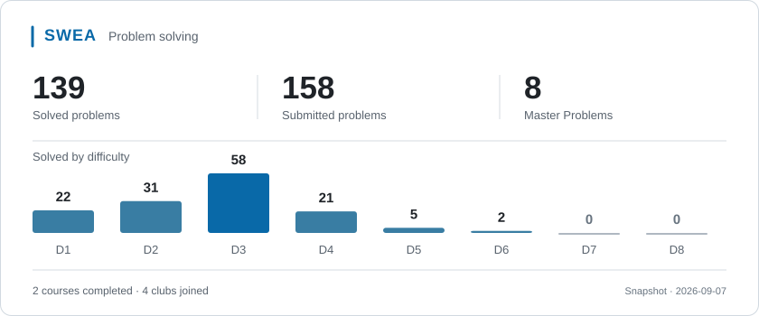

<table>
  <tr>
    <td width="25%" valign="middle">
      

        <strong>I code in</strong> 
        
        
      

      

        <strong>I speak</strong> 
        
         
        
      

      

        <strong>I create with</strong> 
        
        
      

      

        <strong>I play on</strong> 
        
      

    </td>
    <td width="75%" align="center" valign="middle">
       
      My workspace, modeled in Blender
    </td>
  </tr>
</table>

  <picture>
    <source media="(prefers-color-scheme: dark)" srcset="assets/swea-card.svg" />
    <source media="(prefers-color-scheme: light)" srcset="assets/swea-card-light.svg" />
    
  </picture>

