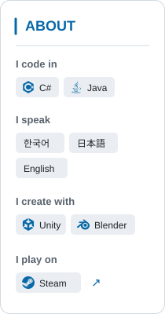
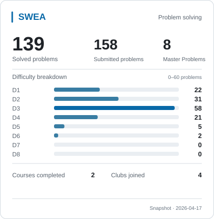
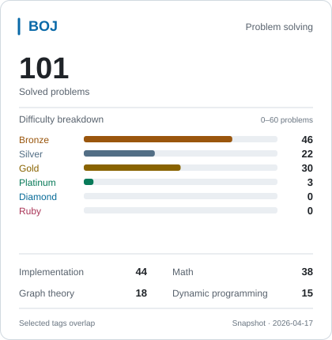

  <a href="https://steamcommunity.com/id/cuding/" title="Open my Steam profile"><picture><source media="(prefers-color-scheme: dark)" srcset="assets/profile-about-dark-40a1d05a57.svg" /><source media="(prefers-color-scheme: light)" srcset="assets/profile-about-light-c627aa0d2e.svg" /></picture></a>
  <picture>
    <source media="(prefers-color-scheme: dark)" srcset="assets/profile-workspace-dark-ab7d9d48b8.svg" />
    <source media="(prefers-color-scheme: light)" srcset="assets/profile-workspace-light-dd9eaa5c3b.svg" />
    
  </picture>

  <picture>
    <source media="(prefers-color-scheme: dark)" srcset="assets/swea-card-bars-dark-94adad6c20.svg" />
    <source media="(prefers-color-scheme: light)" srcset="assets/swea-card-bars-light-5aa77a6470.svg" />
    
  </picture>
  <picture>
    <source media="(prefers-color-scheme: dark)" srcset="assets/boj-card-bars-dark-44b488f94e.svg" />
    <source media="(prefers-color-scheme: light)" srcset="assets/boj-card-bars-light-551fe6e890.svg" />
    
  </picture>

