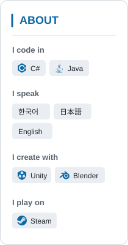

  <a href="https://steamcommunity.com/id/cuding/" title="Open my Steam profile"><picture><source media="(prefers-color-scheme: dark)" srcset="assets/profile-about-dark-8c9b919b8b.svg" /><source media="(prefers-color-scheme: light)" srcset="assets/profile-about-light-c1120fe6ba.svg" /></picture></a>
  <picture>
    <source media="(prefers-color-scheme: dark)" srcset="assets/profile-workspace-dark-674586d186.svg" />
    <source media="(prefers-color-scheme: light)" srcset="assets/profile-workspace-light-43b9d04044.svg" />
    
  </picture>

  <picture>
    <source media="(prefers-color-scheme: dark)" srcset="assets/swea-card-bars-dark-94adad6c20.svg" />
    <source media="(prefers-color-scheme: light)" srcset="assets/swea-card-bars-light-5aa77a6470.svg" />
    
  </picture>
  <picture>
    <source media="(prefers-color-scheme: dark)" srcset="assets/boj-card-bars-dark-44b488f94e.svg" />
    <source media="(prefers-color-scheme: light)" srcset="assets/boj-card-bars-light-551fe6e890.svg" />
    
  </picture>

## Projects

<strong>In Progress</strong> · 5

| Project | Description | Core Tech |
| :--- | :--- | :--- |
| [Shinjuku-Live-Street](https://github.com/hjcud/Shinjuku-Live-Street) | VRChat street-performance world with shared live equipment and simulated traffic. | <picture><source media="(prefers-color-scheme: dark)" srcset="assets/project-tech-unity-dark.svg"></picture> <picture><source media="(prefers-color-scheme: dark)" srcset="assets/project-tech-csharp-dark.svg"></picture> <picture><source media="(prefers-color-scheme: dark)" srcset="assets/project-tech-udonsharp-dark-786c19cce8.svg"></picture> |
| [Idea2Strategy](https://github.com/Idea2Strategy/Idea2Strategy) | Platform for creating, backtesting, and running virtual trading strategies. | <picture><source media="(prefers-color-scheme: dark)" srcset="assets/project-tech-spring-dark.svg"></picture> <picture><source media="(prefers-color-scheme: dark)" srcset="assets/project-tech-python-dark.svg"></picture> <picture><source media="(prefers-color-scheme: dark)" srcset="assets/project-tech-react-dark.svg"></picture> |
| [Stackcord](https://github.com/kcrmin/Stackcord) | Codex collaboration tooling for shared project context, Git coordination, and release checks. | <picture><source media="(prefers-color-scheme: dark)" srcset="assets/project-tech-go-dark.svg"></picture> <picture><source media="(prefers-color-scheme: dark)" srcset="assets/project-tech-python-dark.svg"></picture> |
| [yoiko_core](https://github.com/hjcud/yoiko_core) | Cobblemon server mod with progression, trading, rewards, events, and turtle racing. | <picture><source media="(prefers-color-scheme: dark)" srcset="assets/project-tech-java-dark.svg"></picture> <picture><source media="(prefers-color-scheme: dark)" srcset="assets/project-tech-neoforge-dark-65e8ee1e4f.svg"></picture> |
| [Pixerin](https://github.com/hjcud/Pixerin) | Desktop pixel art editor for drawing by hand and making selection-scoped AI edits. | <picture><source media="(prefers-color-scheme: dark)" srcset="assets/project-tech-electron-dark.svg"></picture> <picture><source media="(prefers-color-scheme: dark)" srcset="assets/project-tech-javascript-dark.svg"></picture> |

<strong>On Hold</strong> · 1

| Project | Description | Core Tech |
| :--- | :--- | :--- |
| [Smash Avatar](https://github.com/SmashAvatar/vrchat-project) Private | VRChat multiplayer project with custom movement, team management, and synchronized player UI. | <picture><source media="(prefers-color-scheme: dark)" srcset="assets/project-tech-unity-dark.svg"></picture> <picture><source media="(prefers-color-scheme: dark)" srcset="assets/project-tech-csharp-dark.svg"></picture> <picture><source media="(prefers-color-scheme: dark)" srcset="assets/project-tech-udonsharp-dark-786c19cce8.svg"></picture> |

<strong>Completed</strong> · 4

| Project | Description | Core Tech |
| :--- | :--- | :--- |
| [Shimanami-Ekranoplan](https://github.com/hjcud/Shimanami-Ekranoplan) | Ekranoplan flight simulator with VR and desktop controls, built for interactive exhibitions. | <picture><source media="(prefers-color-scheme: dark)" srcset="assets/project-tech-unity-dark.svg"></picture> <picture><source media="(prefers-color-scheme: dark)" srcset="assets/project-tech-csharp-dark.svg"></picture> <picture><source media="(prefers-color-scheme: dark)" srcset="assets/project-tech-udonsharp-dark-786c19cce8.svg"></picture> |
| [hinasaki-shaders](https://github.com/hjcud/hinasaki-shaders) | Unity shaders for tears, refraction, pixelation, and holographic sights. | <picture><source media="(prefers-color-scheme: dark)" srcset="assets/project-tech-unity-dark.svg"></picture> ShaderLab · HLSL |
| [yoiko_rank](https://github.com/hjcud/yoiko_rank) Private | Minecraft server mod for player ranks, cosmetic badges, and daily rewards. | <picture><source media="(prefers-color-scheme: dark)" srcset="assets/project-tech-java-dark.svg"></picture> <picture><source media="(prefers-color-scheme: dark)" srcset="assets/project-tech-neoforge-dark-65e8ee1e4f.svg"></picture> |
| [NeoForge-YoikoServerMod-1.21.1](https://github.com/hjcud/NeoForge-YoikoServerMod-1.21.1) Private | Minecraft 1.21.1 server mod with custom mystery-gift items. | <picture><source media="(prefers-color-scheme: dark)" srcset="assets/project-tech-java-dark.svg"></picture> <picture><source media="(prefers-color-scheme: dark)" srcset="assets/project-tech-neoforge-dark-65e8ee1e4f.svg"></picture> |

<strong>Planned</strong> · 1

| Project | Description | Core Tech |
| :--- | :--- | :--- |
| **Pixel Monster Dungeon** Working title | Draw pixel monsters, let AI interpret their traits, and build dungeons for automated battles. | <picture><source media="(prefers-color-scheme: dark)" srcset="assets/project-tech-unity-dark.svg"></picture> <picture><source media="(prefers-color-scheme: dark)" srcset="assets/project-tech-csharp-dark.svg"></picture> Planned stack |

